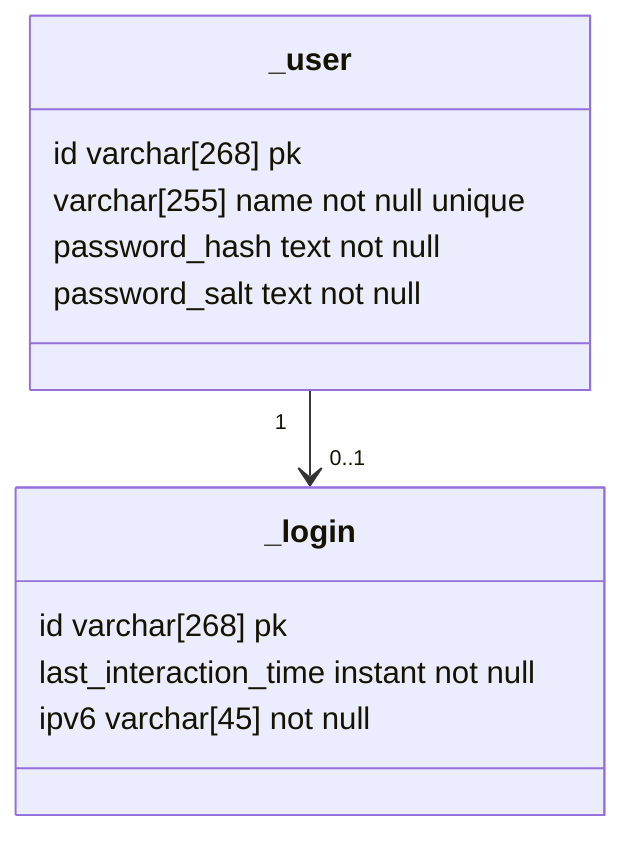

# How will we do user authentication

We will store registrations in a table.

We will store logged in users in a table

User ID (personal page name): base 64 encode of random string

Max length : 13 (random part length) + 255 (max username length) = 268

Username max length : 255
Password max length: 255

## Login

Input : username, password

1. username not in database: error 'Utilisateur inconnu. Inscrivez-vous'
2. user already logged in: error 'Tentative de connexion malicieuse détectée'
3. user password does not correspond: error 'Mot de passe incorrect'
4. login success: go to user's personal page

## Register

Input : username, password, confirm_password

1. password too long: error 'mot de passe trop long (255 caractères max.)'
2. username too long: error 'nom d'utilisateur trop long (255 caractères max.)'
3. password and confirm_password not equal: error 'confirmation différente du mot de passe'
4. username already in database: 'nom d'utilisateur déjà pris'
5. register success: add to database and go to user's personal page.

## Login-required pages

If an user personal page is accessed, check if we have a token that means the current user authenticated already.

All the user pages where login are required will be put in the *user* subdirectory. And we addd a php header to all these pages to redirect to login if not authenticated.

The login page will take an argument: next: where to redirect after authentication succeeds.

Only user profile pages won't redirect - and it addition to checking if the current user is authenticated, it checks if the user is the same as the one of the profile page.

## User pages

When the server is asked for a url with a path of starting with "/user/profile/", fetch the last item. Example "dqsQSD465".

Pass it to a PHP script that will generate the user page.

Maybe we can implement caching later.
