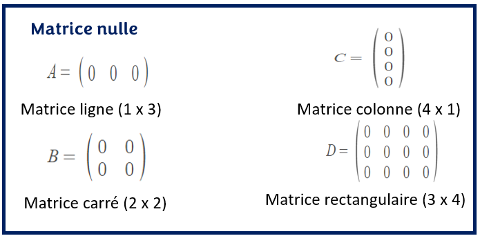
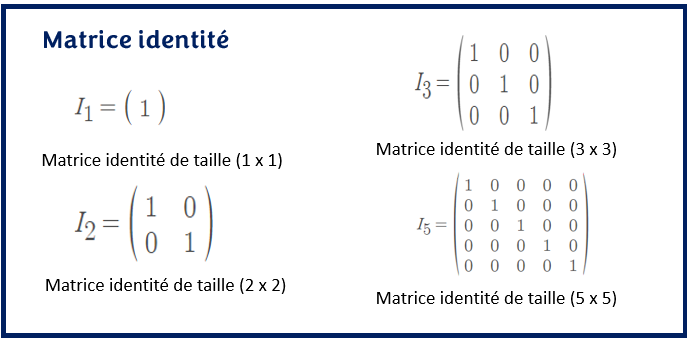
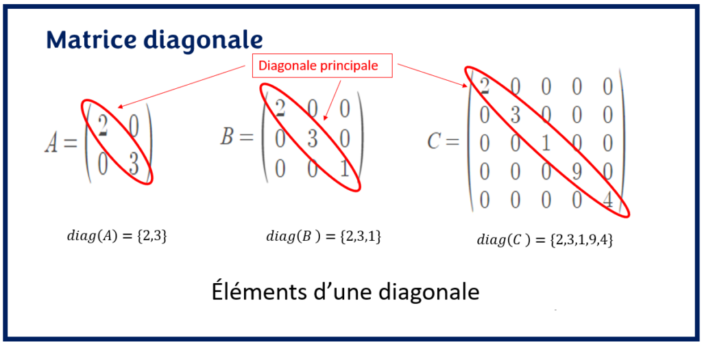
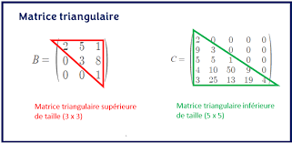
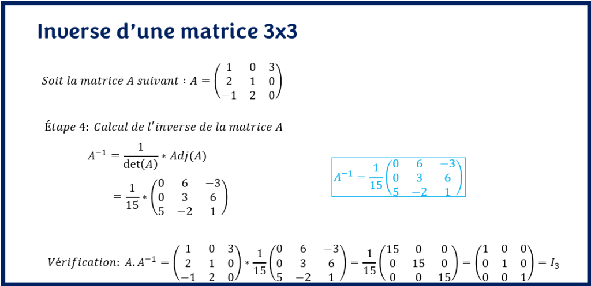
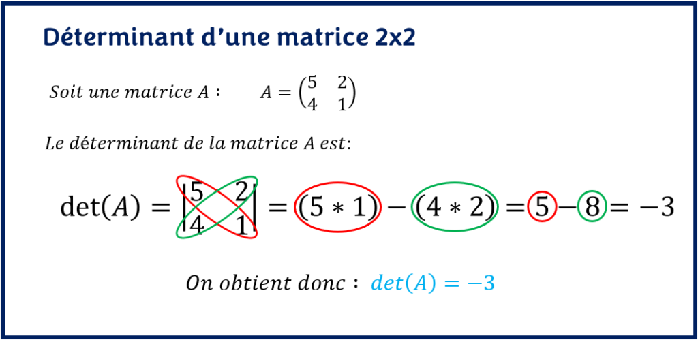
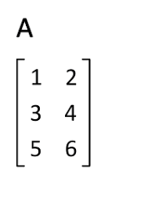
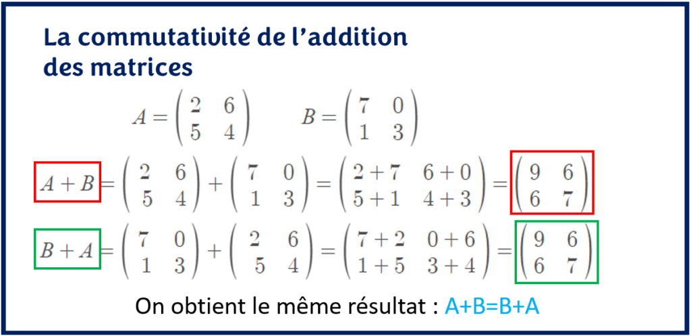
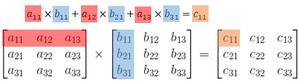

# R1.07 - outils Mathématiques fondamentaux

## Matrice

### Dimension

m \* n = 

### Type de Matrice

#### Matrice Ligne

Dimension :

M1 = 1\*n avec n ∈ N\*\\{1}

#### Matrice Colonne

Dimension :

M2 = n\*1 avec n ∈ N\*\\{1}

#### Matrice Carré

Dimension :

M3 = 2\*2

#### Matrice Rectangle

Dimension :

M4 = n\*m avec n et m ∈ N\* et n > m ou m > n

#### Matrice Identité

#### Matrice Diagonale

Une matrice identité avec l'ensemble des valeurs différents de 1

#### Matrice Triangulaire

#### Matrice Inverse

Une matrice multiplier par son inverse donne la matrice identité

M = n\*n

M \* M' = In

M' \* M = In

Trouver la matrice inverse à partir du déterminant

#### Déterminant

Matrice 2\*2 : 

Une matrice possède un inverse si le déterminant est différent de 0

det(A) = (1.1 \* 2.2) - (2.1 \* 1.2)

### Commande Python

bibliothèque : numpy et numpy.linalg

numpy.`array`(liste) :

Fabrique une matrice à partir d'une liste de liste

numpy.`zeros`(n,m) :

Fabrique une matrice remplis de 0 à partir de la dimension

numpy.`ones`(n,m) :

Fabrique une matrice remplis de 1 à partir des dimension n et m

numpy.`diag`(liste) :

Fabrique une matrice diagonale à partir d'une liste en 1 dimension

numpy.`eye`(n) :

Fabrique une matrice identité en n\*n à partir d'une dimension n

M.`shape`() :

Renvoie la dimension de la matrice : (n,m)

M.`reshape`(m,n) :

Redimensionne une matrice, sans modifier ses termes

numpy.`concatenate`((M1, M2, ...,Mn), axis=0)

<pre>
Créer une matrice par bloc

    axis=0 : par ligne

        M = array([[ 1., 1., 1.],
                    [ 1., 1., 1.],
                    [ 0., 0., 0.],
                    [ 0., 0., 0.]])

    axis=1 : par colonne

        array([[ 1., 1., 1., 0., 0., 0.],
                [ 1., 1., 1., 0., 0., 0.]])
</pre>

numpy.`delete`(M,nb,axis=0)

> Supprime un axe de la matrice

<pre>
    Supprime de la matrice M
    l'axe d'indice nb en ligne

    Donc numpy.delete(M,1,0)
    array([[ 1., 1., 1.],
            [ 0., 0., 0.],
            [ 0., 0., 0.]])
</pre>

### Indice

dimension : 3\*2

`A[1, 0]` # terme de la deuxieme ligne, premiere colonne

`A[0, :]` # premiere ligne sous forme de tableau a 1 dimension

`A[0:1, :]` # premiere ligne sous forme de matrice ligne

`A[ :, 1]` # deuxieme colonne sous forme de tableau a 1 dimension

`A[ :, 1 :2]` # deuxieme colonne sous forme de matrice colonne

`A[1:3, 0 :2]` # sous-matrice lignes 2 et 3, colonnes 1 et 2

### Calcul de Matrice

#### L'addition

#### La multiplication

M1 \* M2 != M2 \* M1

Dimension :

M1 = M2 \* M3 de dimension M2 = 5\*4 M3 = 4\*5

M1 = 5\*5

L'opération :

